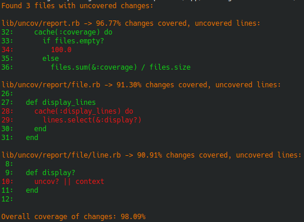

# Uncov
Uncov analyzes test coverage for changed files in your Git repository,
helping you ensure that all your recent changes are properly tested.

Uncov uses `git diff` to detect changes and `simplecov` reports to detect uncovered code.

[The uncov Manifesto](PHILOSOPHY.md)



## Features
- Compare your working tree to a target branch
- Identify changed Ruby files
- Run tests automatically for (changed) relevant files
- Print report of uncovered lines in (changed) files


## Installation
```bash
gem install uncov
```
Or add to your Gemfile (only for convenience):
```ruby
gem 'uncov', require: false
```


## Usage
Basic usage:
```bash
uncov
```

### Display configuration options
```bash
$ uncov -h
Usage: uncov [options]
    -t, --target TARGET              Target branch for comparison, default: "HEAD"
    -r, --report FILTER              Report filter to generate file/line list, one_of: "diff_files", "diff_lines"(default), "git_files", "nocov_lines"
    -o, --output-format FORMAT       Output format, one_of: "terminal"(default)
    -C, --context LINES_NUMBER       Additional lines context in output, default: 1
        --test-command COMMAND       Test command that generates SimpleCov, default: "COVERAGE=true bundle exec rake test"
        --simplecov-file PATH        SimpleCov results file, default: "autodetect"
        --relevant-files FN_GLOB     Only show uncov for matching code files AND trigger tests if matching code files are newer than the report, default: "{{bin,exe,exec}/*,{app,lib}/**/*.{rake,rb},Rakefile}"
        --relevant-tests FN_GLOB     Trigger tests if matching test files are newer than the report, default: "{test,spec}/**/*_{test,spec}.rb"
        --nocov-ignore               Ignore :nocov: markers - consider all lines, default: false
        --nocov-covered              Report :nocov: lines that have coverage, default: false
        --debug                      Get some insights, default: false
    -h, --help                       Print this help

Report FILTERs:
diff_files  - Report missing coverage on added/changed files in the git diff
diff_lines  - Report missing coverage on added lines in the git diff
git_files   - Report missing coverage on files tracked with git
nocov_lines - Report coverage on nocov lines, requires one or both: --nocov-ignore / --nocov-covered

Report FILTERs take NOTICE:
git*/diff*  - filters will not consider new files unless added to the git index with `git add`.
nocov*      - filters/flags only work with coverage/.resultset.json SimpleCov files,
              coverage.json does not provide the information needed.

FN_GLOB: shell filename globing -> https://ruby-doc.org/core-3.1.1/File.html#method-c-fnmatch
         in bash: `shopt -s extglob dotglob globstar` and test with `ls {app,lib}/**/*.rb`

uncov 0.5.0 by Michal Papis <mpapis@gmail.com>
```


## Configuration file
`.uncov` file in the directory where it's ran stores default options,
specify one argument per line - this eliminates the need for special parsing of the file.

Example:
```text
--target
develop
--test-command
COVERAGE=1 rspec
```


## Using in CI
`uncov` uses itself to check new missing code coverage [.github/workflows/ci.yml](.github/workflows/ci.yml),
no need to set minimal, always get better.

Ideas for CI:
- run `uncov` after running your tests with coverage enabled,
- be less restrictive - provide custom `--relevant-files` pattern
  that excludes some paths you do not think should be always tested.


## Requirements
- Ruby 3.2+
- A Git repository
- SimpleCov for test coverage


## Contributing
Contributing, developing, pull requests, releasing, security -> [CONTRIBUTING.md](CONTRIBUTING.md).


## License
The gem is available as open source under the terms of the [MIT License](https://opensource.org/licenses/MIT).
